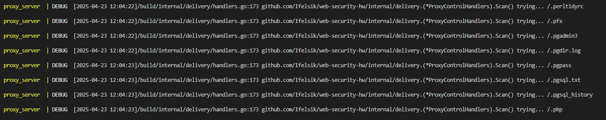
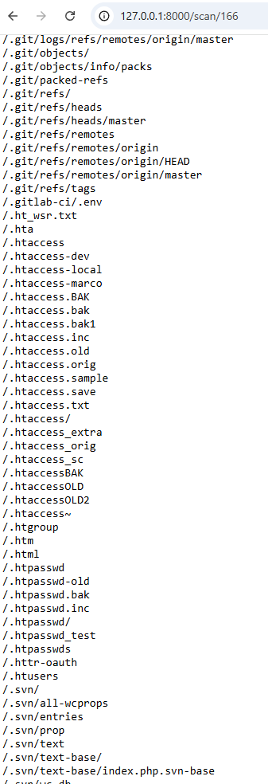

# MITM-прокси

## Запуск

Предварительно, нужно выпустить сертификат удостоверящего центра  
```
make ca-gen
```

Далее, созданный сертификат надо установить в хранилище доверенных корневых сертификатов.
Нужно для того, чтобы на каждое соединение в браузере не вылетало предупреждение,
что сертификат недействительный.

Создание контейнеров
```
docker compose build
```

Запуск
```
docker compose up
```
На `127.0.0.1` на `8080` порту будет запущен прокси сервер,
а на `127.0.0.1:8000` – веб-API

Ручки:  
/requests – список запросов  
/requests/id – вывод 1 запроса  
/repeat/id – повторная отправка запроса  
/scan/id – сканирование запроса (работает **оооочень медленно**, минут 3-5, в идеале надо на вебсокете) 

### Пример поиска

Перебор путей DirBuster



Результат работы на уязвимом сайте



**Примечание**: Есть баг с тем, что при первом запуске в браузере может появиться сообщение
о том, что время выпуска сертификата опережает текущее время. В этом случае надо просто перезагрузить странцу.


