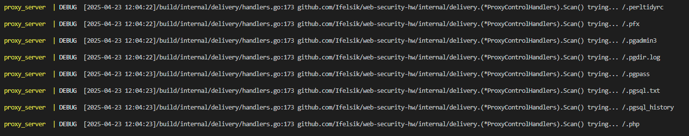
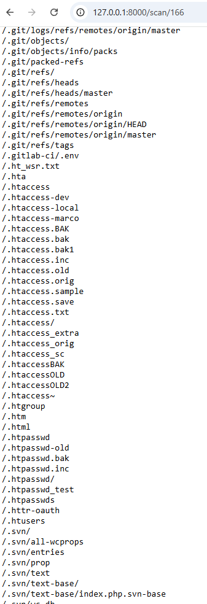

# MITM-прокси

## Описание

## Использование

### Выпуск сертификата 

Нужно выпустить сертификат удостоверяющего центра и ключ для самих сертификатов
```
make ca-gen && make pk-gen
```

Этот сертификат надо установить в хранилище доверенных корневых сертификатов, либо в задать в настройках конкретного браузера.
Нужно для того, чтобы на каждое соединение в браузере не вылетало предупреждение,
что сертификат недействительный.
** Это небезопасно, после использования не забудьте удалить этот сертификат! **

Затем, нужно отредактировать файл конфигурации `config.yaml` в корне проекта.

### Запуск

Запустить прокси можно 2 способами: сбилдить вручную (пока что рекомендуемый) и с помощью Docker.

#### Ручной билд (Рекомендуется)

Можно сбилдить исполняемый файл. По умолчанию имеет имя `mitm-proxy`

```
make build
```

#### Docker

Сборка при помощи docker composer

```
docker compose up --build
```

### Работа

На `127.0.0.1` на `8080` порту будет запущен прокси сервер,
а на `127.0.0.1:8000` – веб-API.

Остальное временно не работает из за полного переписывания утилиты.

Ручки:  
/requests – список запросов  
/requests/id – вывод 1 запроса  
/repeat/id – повторная отправка запроса  
/scan/id – сканирование запроса (работает **оооочень медленно**, минут 3-5, в идеале надо на вебсокете) 

#### Пример поиска

Перебор путей DirBuster



Результат работы на уязвимом сайте




